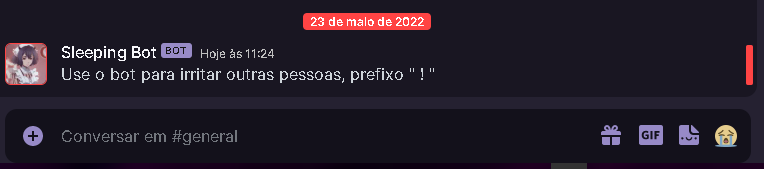

#README 

<h1> This bot is a bot developed by me, to test my knowledger🤖🤖 </h1>

 
 

<h2> Project under construction... 🛠🛠</h2>

 
 

<h1> - Important warning ☢☢</h1>

<h3> I used discord.js version 12, if you use other versions there will be errors in your application 🖥🖥</h3>

 
 

### Features

- [ x ] The Bot catch your mesage and reply
- [ ] Funny commands
- [ ] Moderation commands

 
 

 

<h3>feel free to contribute to this little project, I'm open to criticism</h3>

 

Made with 💜💜  By Gustavo Duarte

